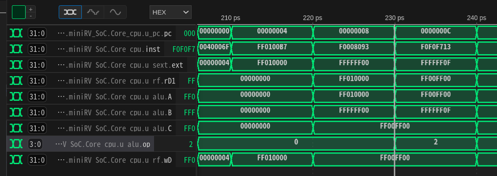
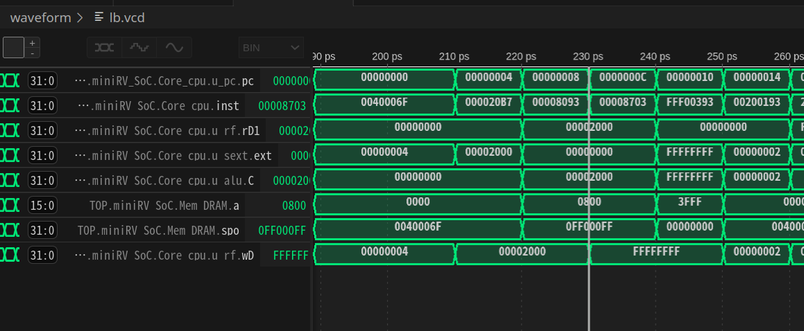

## andi指令波形分析

测试样例：
```assembly
00000000 <_start>:
   0:	0040006f          	jal	x0,4 <reset_vector>

00000004 <reset_vector>:
   4:	ff0100b7          	lui	x1,0xff010
   8:	f0008093          	addi	x1,x1,-256 # ff00ff00 <_end+0xff00df00>
   c:	f0f0f713          	andi	x14,x1,-241
```



如图所示，可以看到在230ps时:

1. `pc=0x0000000c`，取得指令`inst=0xf0f0f713`;
2. 寄存器读数`rf.rD1=0xff00ff00`, 即之前指令载入的x1值;
3. 符号拓展单元输出`ext=0xffffff0f`, 即立即数-241;
4. `alu.op=0b10`, 即执行按位与操作;
5. `alu.A=0xff00ff00=rf.rD1`, `alu.B=0xffffff0f=ext`, 操作数选择符合预期;
6. `alu.C=0xff00ff00`, 即A和B按位与后的结果;
7. `rf.wD=0xff00ff00=alu.C`, 即写入寄存器的值;

## lb指令波形分析

测试样例：
```assembly
00000000 <_start>:
   0:	0040006f          	jal	x0,4 <reset_vector>

00000004 <reset_vector>:
   4:	000020b7          	lui	x1,0x2
   8:	00008093          	addi	x1,x1,0 # 2000 <begin_signature>
   c:	00008703          	lb	x14,0(x1)
```



如图所示，可以看到在230ps时:

1. `pc=0x0000000c`，取得指令`inst=0x00008703`;
2. 寄存器读数`rf.rD1=0x00002000`, 即之前指令载入到x1寄存器的DRAM基地址;
3. 符号拓展单元输出`ext=0x00000000`, 即立即数偏移量0;
4. `alu.C=0x00002000`, 即偏移后的目标地址;
5. `dram.a=0x0800`, 即按字寻址的目标地址（右移两位）;
6. `dram.spo=0x0ff000ff`, 即读出的数据，其中最低字节为0xff，即lb指令实际读取的结果;
7. `rf.wD=0xffffffff=alu.C`, 即符号拓展后写入寄存器的值;

## beq指令波形分析

测试样例：
```assembly
00000000 <_start>:
   0:	0040006f          	jal	x0,4 <reset_vector>

00000004 <reset_vector>:
   4:	00200193          	addi	x3,x0,2
   8:	00000093          	addi	x1,x0,0
   c:	00000113          	addi	x2,x0,0
  10:	00208663          	beq	x1,x2,1c <reset_vector+0x18>
  14:	2a301863          	bne	x0,x3,2c4 <fail>
  18:	00301663          	bne	x0,x3,24 <test_3>
  1c:	fe208ee3          	beq	x1,x2,18 <reset_vector+0x14>
  20:	2a301263          	bne	x0,x3,2c4 <fail>
```


如图所示，可以看到在240ps时:

1. `pc=0x00000010`，取得指令`inst=0x00208663`;
2. ALU的两个操作数`alu.A=0x00000000`, `alu.B=0x00000000`, 即x1和x2的值;
3. `alu.op=0b01`, 即执行减法操作（利用减法操作实现相等比较）;
4. `alu.zf=1`, 即相等比较结果为真;
5. `npc.op=0b01`, 即当比较结果为真时进行跳转;
6. `npc.npc=0x0000007`（省略了末位的两位0，实际地址为`0x0000001c`）, 即跳转到`0x0000001c`处执行;
7. 250ps时，`pc=0x0000001c`;